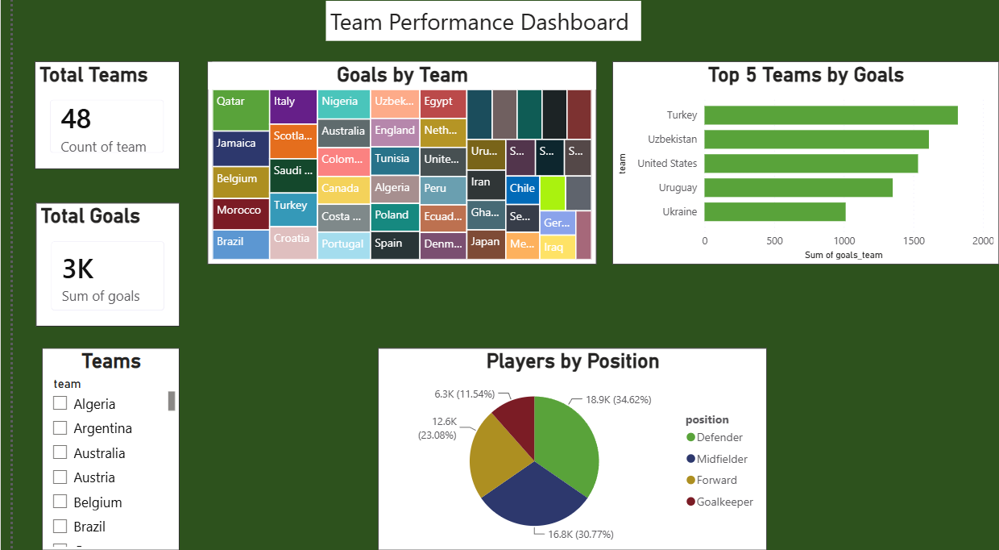
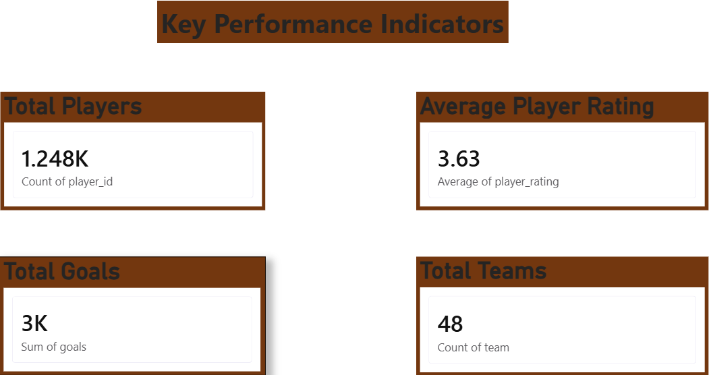
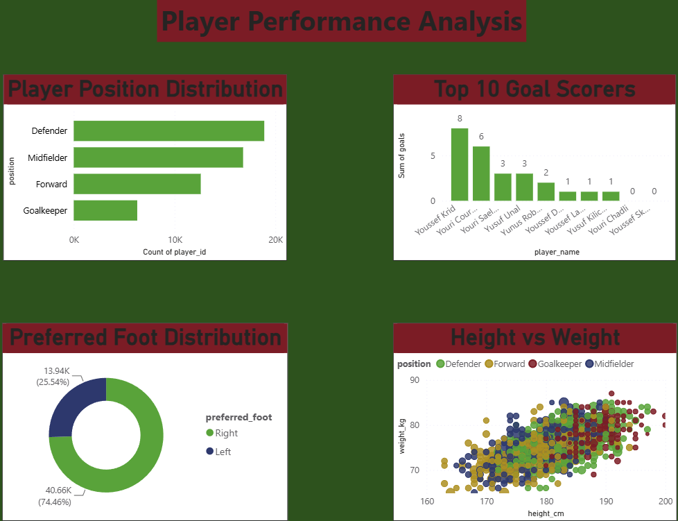
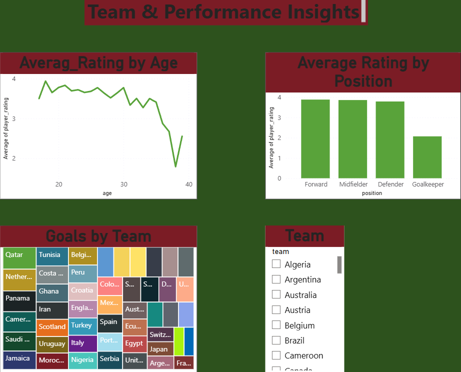

# ⚽ FIFA-World-Cup-Player-Performance
## 📌 Project Overview

This project analyzes FIFA World Cup player performance data using Python to uncover meaningful insights from player statistics. The project includes data cleaning, exploratory data analysis (EDA), and data visualization to understand player performance across different metrics.

---

## 🎯 Objectives

- Clean and preprocess the dataset
- Perform Exploratory Data Analysis (EDA)
- Analyze player performance metrics
- Discover trends and patterns
- Create insightful visualizations
- Present findings through dashboards and charts

---

## 🛠️ Tech Stack

- Python
- Pandas
- NumPy
- Jupyter Notebook

---

## 📂 Dataset Features

- Player Name
- Team
- Position
- Age
- Goals
- Assists
- Matches Played
- Minutes Played
- Overall Rating

---

# 📊 Dashboard Preview

> Replace the image below with your dashboard screenshot.



---

# 📈 Project Visualizations

### Key Performance Indicators



---

### Players Performance Analysis




---

### Team & Performance Insights




---


## 📊 Key Insights

- Identified top-performing players based on goals and assists.
- Analyzed player age distribution.
- Compared attacking performance across players.
- Studied position-wise player distribution.
- Explored relationships between different performance metrics.

---

## 📁 Project Structure

```
FIFA-World-Cup-Player-Performance-Analytics
│
├── data
│   └── fifa_world_cup_players.csv
│
├── images
│   ├──Key Performance Indicators
    ├── dashboard.png
│   ├── Players Performance Analysis
│   ├── Team & Performance Insights

│   └── FIFA_World_Cup_Analysis.ipynb
    └── README.md
```

---

## 🚀 Skills Demonstrated

- Data Cleaning
- Exploratory Data Analysis (EDA)
- Data Visualization
- Statistical Analysis
- Python Programming
- Problem Solving
- Data Storytelling

---

## 📌 Future Improvements

- Interactive Power BI Dashboard
- Machine Learning Model for Player Performance Prediction
- Team Performance Analytics
- Player Comparison Dashboard

---

## 👩‍💻 Author

**Pinky**
